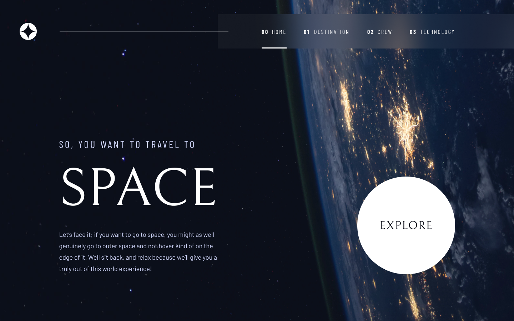

# Space Tourism

#### Access here -> [Space Tourism](https://space-tourism-six-zeta.vercel.app/) 

# 📋 Overview

Space Tourism is a promotional website that aims to provide exciting information about space tourism. The website is built using modern technologies such as React, TypeScript, Styled Components and includes testing using the testing library. It is a fictional representation of the space tourism industry, presenting exciting opportunities to travel beyond our atmosphere.

 

# 🛠   Technologies Used
   

 

# 🔮   Key Features:

- Home Page: Provides an overview of space tourism, featuring stunning images and information about exciting space destinations.

- Destination: Displays a variety of possible travel destinations, these being: moon, mars, europe and titan.

- Crew: Provides details about your team that will accompany you on this trip

- Technology: provides information about the trip's transportation technologies.

 

# 🎨  Design

Figma: [Space Tourism](https://www.figma.com/file/isLvYwZZcINZc28sm1QTNL/space-tourism-website?type=design&node-id=0%3A1&mode=design&t=uGbUTsoboRjEVZdy-1)

 

# 🔧 How to Run the Project

### Environment setup:

- [Node](https://nodejs.org/en)

### in the terminal:

- Clone this repository. `https://github.com/matheusleite01/Space-Tourism.git`
- Run `npm install`
- Run `npm run dev`
- Ready 🎉

 

# 📌 Next Steps

- Improve the layout and user experience.
- Add extra features, such as extended forecast, dynamic weather icons, etc.
- Implement automated testing.
- Refactor the code to follow best practices and development standards.

Feel free to contribute with improvements, bug fixes, or suggestions. I hope this project serves as a useful learning opportunity in React!

 

